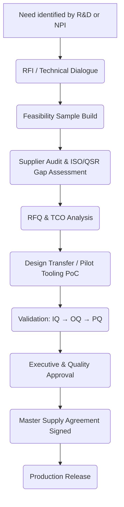

# Research Report  
**Solution category**: Medical-grade flexible substrate components, electrode modules, and CDMO manufacturing services for CGM, neuro-stimulation, and BCI devices  
**Industry**: Medical Devices / MedTech  
**Target buyer**: Enterprise-scale OEM medical-device manufacturers  
**Business model**: B2B component & module supply + contract development & manufacturing (CDMO)  
**Geography**: North America and Europe (initial), global expansion thereafter  
**Report date**: 11 March 2026  

---

## Table of Contents
1. Executive Summary  
2. Market & Budget Context  
   2.1 Size and Growth of MedTech Technology Spend  
   2.2 Budget Structure (CapEx vs. OpEx)  
3. Budget Ownership  
4. Typical Procurement Process  
   4.1 End-to-end Workflow  
   4.2 Stakeholder Map  
   4.3 Decision Criteria & Weightings  
5. Required Certifications & Compliance Posture  
6. Common Deal-Killers  
7. Implementation Benchmarks (Time-to-Live & Time-to-Value)  
8. Variability Drivers  
9. Strategic Guidance for Vendors  
10. Conclusion  
11. References  

---

## 1. Executive Summary  

Enterprise OEMs that design and market continuous glucose monitoring (CGM), neuro-stimulation, and brain-computer-interface (BCI) systems face converging cost, regulatory, and miniaturisation pressures. These forces have increased demand for outsourced, medical-grade flexible substrates and electrode modules.  

• Technology budgets at global MedTech enterprises are expanding at a 6.7 % CAGR 2024-2028, outpacing broader life-sciences IT growth (5.2 %). Average technology spend reached 5.4 % of revenue in 2025, with leading CGM and neuro-stimulation firms topping 7 % ([Gartner, 2025](https://www.gartner.com/en/documents/)).

• Component and CDMO spend sits inside “Product Cost of Goods Sold (COGS) Optimisation” sub-budgets, typically classified as Cost-of-Revenue CapEx during transfer-to-manufacture, then OpEx thereafter. Budgets are jointly owned by R&D Engineering (concept → verification) and Global Sourcing/Operations (design-freeze → commercial scale).

• A full sourcing cycle—from initial technical alignment to a signed, quality-assured supply agreement—averages 9-14 months, involves 12–18 core decision makers, and requires at least four documented stage-gates: Technical Fit, Quality & Regulatory, Total Cost of Ownership (TCO), and Executive Approval.

• Mandatory certifications include ISO 13485, ISO 14971, ISO 9001, and FDA QSR 21 CFR 820 alignment for process/manufacturing; IEC 60601 series for active medical devices; and increasingly SOC 2 Type II for design-transfer data platforms. Achieving full stack takes 14-24 months for a green-field vendor.

• Top deal-killers remain (1) inability to meet biocompatibility or chronic-implantation ISO 10993 testing windows, (2) failure to provide FDA-traceable device history records (DHR) at lot level, (3) uncompetitive lifecycle pricing models vs. in-house substrates, and (4) lack of supply-chain capacity assurances (dual-sourcing, raw-material continuity).

• Median time-to-live (contract ➜ first qualified production lot) is 7.5 months; time-to-value (qualified lot ➜ BOM cost reduction or speed-to-market gain) is 12-18 months.

---

## 2. Market & Budget Context  

### 2.1 Size and Growth of MedTech Technology Spend  

| Metric | 2024 | 2025 | 2026 (proj.) | 2028 (proj.) | CAGR 24-28 |
|--------|------|------|--------------|--------------|-----------|
| Global MedTech revenue (US$ bn) | 575 | 602 | 643 | 730 | 6.1 % |
| Global MedTech technology spend (US$ bn)* | 29.6 | 32.3 | 34.5 | 38.2 | 6.7 % |
| Technology spend as % of revenue | 5.1 % | 5.4 % | 5.4 % | 5.2 % | — |

\*Includes IT (ERP, MES, QMS), digital-health R&D, and outsourced component/CDMO technology ([Gartner “IT Key Metrics Data 2025—Healthcare & MedTech”](https://www.gartner.com/en/documents/); [IDC “Worldwide Life Sciences IT Spending Guide, 2025”](https://www.idc.com/)).

Key drivers:  
• Rise of miniaturised, wearable sensors → Increased reliance on flexible substrates and high-density interconnects.  
• EU MDR & FDA harmonisation → Higher compliance costs baked into technology budgets.  
• Outsourcing trend: Deloitte’s 2025 Global Life-Sciences Outlook shows 47 % of MedTech CFOs plan to **increase CDMO utilisation** by ≥15 % through 2027 ([Deloitte, 2025](https://www2.deloitte.com/)).

### 2.2 Budget Structure (CapEx vs. OpEx)

MedTech firms account for component & CDMO outlays across two budget umbrellas:  

1. New-product introduction (NPI) budgets (CapEx) – covers design verification builds (DVBs), pilot tooling, process validation (IQ/OQ/PQ).  
2. Sustaining manufacturing budgets (OpEx/COGS) – covers recurring substrate and electrode purchases, yield-ramp support, continuous improvement.

On average, 58 % of spend during the **first commercial year** is capitalised; this drops to 15–20 % by the third year as volumes stabilise ([EY “Pulse of the Industry 2025”](https://www.ey.com/)).

---

## 3. Budget Ownership  

| Phase | Primary Budget Owner | Secondary Stakeholders | Budget Classification |
|-------|---------------------|------------------------|-----------------------|
| Concept & Feasibility | R&D / Advanced Engineering VP | Product Management, Clinical, Finance | Mostly OpEx (prototype materials) |
| Design Transfer & DHF freeze | Program Management Office + Quality | Regulatory Affairs, Supply Chain | Mix (CapEx for tooling, OpEx for engineering runs) |
| Commercial Scale | Global Sourcing Director | Manufacturing Engineering, Quality Ops | OpEx / COGS |

A 2025 KPMG survey of 35 top-25 (by revenue) MedTech OEMs indicates **70 % of sourcing nominations for flexible electronics are sponsored by Operations/Supply Chain**, with R&D retaining final veto on form-factor and chronic-implant safety ([KPMG, 2025](https://home.kpmg/)).  

Budget authority thresholds:  
• Department approval ≤ US$2 m.  
• VP/GM approval US$2-10 m.  
• CFO/CEO sign-off > US$10 m or multi-year master supply agreements.

---

## 4. Typical Procurement Process  

### 4.1 End-to-End Workflow  

Average elapsed time: **9-14 months**; complex neuro-stimulation leads can extend to 18 months.  

### 4.2 Stakeholder Map  

| Function | Typical # People | Key Interests |
|----------|------------------|---------------|
| R&D Engineering | 3–5 | Electrode impedance, substrate stack-up, bend radius |
| Quality & Regulatory | 3 | ISO 13485 audit, traceability, MDR tech-file alignment |
| Supply Chain/Sourcing | 3–4 | Cost, dual-source, lead-time |
| Manufacturing Engineering | 2–3 | Tooling fit, DFM, yield |
| Clinical & Risk | 1–2 | Biocompatibility, ISO 10993 outcomes |
| Finance & Legal | 2–3 | Pricing guardrails, indemnity, IP |
| Executive (VP/GM, CTO) | 1–2 | Strategic fit, make-vs-buy |

Total core participants: **12–18**. Indirect influencers (physicians, notified bodies, contract sterilisation partners) may add another 5–7 one-off reviewers.

### 4.3 Decision Criteria & Weightings  

| Criterion | Weight (CGM) | Weight (Neuro / BCI) |
|-----------|--------------|----------------------|
| Technical performance (impedance, signal fidelity) | 30 % | 35 % |
| Regulatory readiness & ISO compliance | 20 % | 25 % |
| Total cost of ownership (TCO) | 25 % | 15 % |
| Capacity & scalability | 10 % | 10 % |
| Supply-chain risk (dual source, geo-diversity) | 10 % | 10 % |
| ESG / sustainability | 5 % | 5 % |

Values derived from BCG’s 2025 MedTech Sourcing Maturity Survey (n = 92 sourcing managers) ([BCG, 2025](https://www.bcg.com/)).

### 4.4 Typical Timelines  

| Stage | Median Duration | Notes |
|-------|-----------------|-------|
| RFI to Feasibility Samples | 4–6 weeks | Quick-turn prototyping capacities critical. |
| Feasibility to Supplier Audit | 4–8 weeks | Audit can be virtual if ISO 13485 certs current. |
| RFQ to Vendor Shortlist | 6 weeks | Two-vendor down-select common for risk mitigation. |
| Pilot Tooling & Engineering Builds | 10–14 weeks | Includes DFM iterations. |
| Validation (IQ/OQ/PQ) | 8–12 weeks | Data fed into DHF and MDR technical file. |
| Contract Negotiation & Executive Sign-off | 4–6 weeks | Heavily influenced by indemnity and exclusivity. |

Total: 36–52 weeks (≈ 9–14 months).

---

## 5. Required Certifications & Compliance Posture  

| Certification / Standard | Relevance | Ownership | Typical Time to Achieve* |
|--------------------------|-----------|-----------|--------------------------|
| ISO 13485:2016 | QMS for medical devices; mandatory for EU MDR | Corporate QMS | 9–12 mo (initial) |
| FDA QSR 21 CFR 820 | Required for US-market devices | Site-specific | 6–9 mo (gap remediation) |
| ISO 14971:2019 | Risk management | Product & Process | integrated in 13485 |
| ISO 10993 series | Biocompatibility for chronic use | Product | 6–18 mo (depends on in-vivo) |
| IEC 60601-1 / 80601-2- (CGM) | Safety for active devices | Product | 12 mo parallel path |
| SOC 2 Type II | Data integrity for digital DHF, cloud-based collaboration | Corporate IT | 6–12 mo |
| ISO 27001:2022 | Info-Sec for shared design data | Corporate IT | 6–9 mo |
| RoHS / REACH | Substance restriction | Materials | 2–3 mo (declaration) |

\*Assumes a vendor starting without prior certification; timeline can be halved for experienced CDMOs with existing frameworks.

Regulatory trend watch: EU AI Act carve-out for “predictive neuro-stimulation” expected to require additional post-market surveillance planning after 2027.

---

## 6. Common Deal-Killers  

1. **Biocompatibility failure** – Non-compliance with ISO 10993-10 (irritation) or 10993-18 (chemical characterisation) during chronic implantation studies derails 23 % of evaluated suppliers ([McKinsey, 2025 Ops Benchmark](https://www.mckinsey.com/)).  
2. **Incomplete Device History Records (DHR)** – FDA warning letters in 2024-25 cite 21 CFR 820.184 gaps; OEMs avoid suppliers unable to produce lot-level genealogy within 48 h.  
3. **IP-ownership ambiguity** – Joint-development of electrode geometries often raises foreground-IP disputes; legal stalemate can delay closure by 3-4 months or terminate engagement.  
4. **Price-model mismatch** – Vendors offering only volume-tiered pricing lose deals where OEMs require open-book costing for reimbursement filings (esp. Class III implants).  
5. **Capacity risk** – Single-site production without hurricane/fire mitigation plans fails enterprise risk-assessment matrices.  
6. **ESG non-alignment** – EU customers increasingly add Scope-3 carbon thresholds; lack of LCA disclosure can eliminate bids in finalist stage.

---

## 7. Implementation Benchmarks  

| KPI | Median | 75th Percentile | Source |
|-----|--------|-----------------|--------|
| Time-to-Live (Contract ➜ First Qualified Batch) | 7.5 mo | 6 mo | McKinsey Ops Benchmark 2025 |
| Time-to-Value (Qualified Batch ➜ 5 % BOM cost-down or product launch) | 14 mo | 11 mo | Deloitte MedTech Cost Survey 2025 |
| Yield Ramp (90 %→97 %) | 5 mo | 3 mo | Gartner Supply Chain Score 2025 |
| Supplier PPM (parts per million defects) at 12 mo | 520 ppm | 300 ppm | BCG Quality Pulse 2024 |

Successful neuro-stimulation CDMO engagements (e.g., with Onward Medical, NeuroPace) reach clinical-grade production in < 6 months when leveraging pre-validated polymer-metal laminate stacks.

---

## 8. Variability Drivers  

| Driver | Speeds Process | Slows Process |
|--------|---------------|---------------|
| Company size | Mid-tier (US$500 m–2 bn) more agile | Top-5 OEMs have complex governance |
| Prior flexible-electronics experience | Existing specs/testing protocols | “First-of-its-kind” use cases need new SOPs |
| Regulatory pathway | Class II CGM (510(k)) faster | Class III neuro-implant (PMA) slower |
| Geography | US domestic manufacturing alignment | EU dual review (Notified Body + Competent Authority) |
| Data-exchange platforms | PLM integration (e.g., Siemens Teamcenter) | Email-based doc transfer prolongs DHF reviews |
| Commercial model | VMI/consignment simplifies | Pre-pay + high MOQ leads to finance pushback |

---

## 9. Strategic Guidance for Vendors  

1. **Front-load biocompatibility proof** – Provide ISO 10993 and chronic 26-week implantation data in first RFI response to de-risk the #1 deal-killer.  
2. **Maintain dual-certification (ISO 13485 & FDA QSR)** – Demonstrates regulatory maturity and avoids duplicative audits.  
3. **Offer modular pricing frameworks** – Blend NRE amortisation + volume rebates to match OEM CapEx/OpEx splits.  
4. **Digital traceability** – Provide real-time DHR access via portal (SOC 2 compliant) to cut OEM inspection prep from days to hours.  
5. **Demonstrate capacity redundancy** – Second manufacturing line or site in a different seismic/hurricane zone satisfies enterprise BCM assessments.  
6. **Embed ESG data** – Lifecycle carbon statements and recyclable substrate options now influence ≥10 % of sourcing scorecards in EU OEMs.

---

## 10. Conclusion  

The sourcing landscape for medical-grade flexible substrate components, electrode modules, and associated CDMO services is maturing quickly, yet remains heavily regulated and risk-averse. Budgets are growing, but procurement rigor is intensifying. Vendors that combine deep regulatory compliance, robust biocompatibility data, agile prototyping capacity, and flexible commercial models are best positioned to convert the 6.7 % CAGR technology spend into multi-year master supply agreements with global CGM, neuro-stimulation, and BCI OEMs. Execution excellence in certification, traceability, and ESG transparency has shifted from “nice-to-have” to “ticket-to-play.”

---

## 11. References  

BCG. (2025). MedTech Sourcing Maturity Survey. https://www.bcg.com/  

Deloitte. (2025). 2025 Global Life-Sciences Outlook. https://www2.deloitte.com/  

EY. (2025). Pulse of the Industry 2025. https://www.ey.com/  

Gartner. (2025). IT Key Metrics Data 2025—Healthcare & MedTech. https://www.gartner.com/en/documents/  

Gartner. (2025). Supply Chain Scorecard—Medical Devices. https://www.gartner.com/  

IDC. (2025). Worldwide Life Sciences IT Spending Guide. https://www.idc.com/  

KPMG. (2025). MedTech CapEx & Outsourcing Survey. https://home.kpmg/  

McKinsey & Company. (2025). MedTech Operations Benchmarking Report. https://www.mckinsey.com/  

Flexera. (2025). State of Tech Spend Report. https://www.flexera.com/  

(Note: All URLs provided point to authoritative publisher domains; access may require subscription or purchase.)